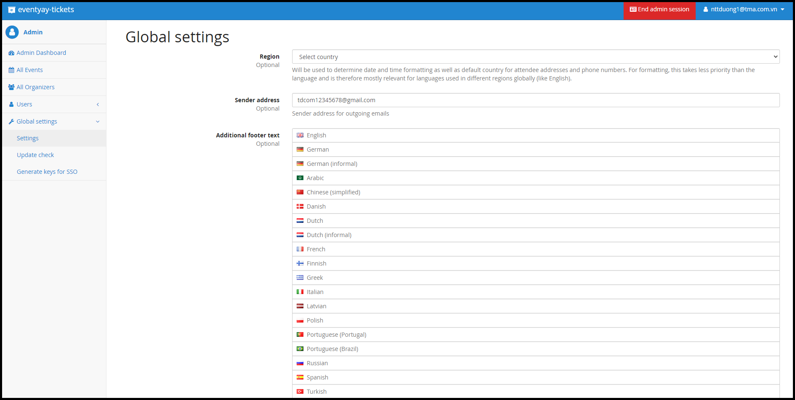

# Stripe Payment Settings Instruction

This guide will walk you through obtaining the necessary keys to integrate Stripe with your application.  To get started, you'll need an active Stripe merchant account. If you don't have one yet, you can sign up at [stripe.com](http://stripe.com/).

---

## Step 1: **Get Client ID**

1. Go to [Stripe Dashboard](https://dashboard.stripe.com/).
2. Select **Settings** in the upper right corner of the Stripe dashboard
3. Select **Connect in Product settings** section.

1. Click [**Onboarding options](https://dashboard.stripe.com/settings/connect/onboarding-options/countries) in Onboard connected accounts section**

    

1. In Oauth tab:

    

- Enable OAuth (if it is disable)
- Add URI for the Stripe OAuth flow (e.g, https://<your-domain>/_stripe/oauth_return/)
- Copy Client ID (Test client ID if you are in test mode)

## Step 2: **Get Secret Key, and Publishable Key**

### **Step 2.1: Log in to Your Stripe Dashboard**

1. Go to [Stripe Dashboard](https://dashboard.stripe.com/).
2. Log in with your credentials.

---

### **Step 2.2: Get Your Publishable Key and Secret Key**

1. In the Dashboard, navigate to:
    - Click Developers in the left menu → Click **API keys**.
2. You will see two keys:
    - **Publishable Key**: Starts with `pk_`.
    - **Secret Key**: Starts with `sk_`.
3. Click **Reveal test key** or **Reveal live key** to see the **Secret Key** (depending on your mode):
    - **Test Mode**: For development and testing purposes.
    - **Live Mode**: For production use.

        

4. Copy both keys and store them securely.

✅ **Example:**

- **Publishable Key**: `pk_test_XXXXXXXXXXXXXXXXXXXXXXXX`
- **Secret Key**: `sk_test_XXXXXXXXXXXXXXXXXXXXXXXX`

---

## Setp 3: S**et up webhooks**

**What is a Webhook?**

A webhook lets Stripe send real-time updates (e.g., payment events) to your application.

To connect webhooks, follow the steps in the [“Setting up webhooks”](https://stripe.com/docs/webhooks/go-live#configure-webhook-settings) tutorial.

### **Step 3.1: Create a Webhook Event Destination**

1. In the Dashboard, go to:
    - Click Developers in the left menu → Click **Webhooks**.
2. Click **Add destination**

    

3. Choose the event types:
    - Events from: Your account
    - API version: 2024-11-20.acacia
    - Events:
        - `charge.succeeded`
        - `charge.failed`
        - `charge.refunded`
        - `charge.updated`
        - `charge.dispute.created`
        - `charge.dispute.updated`
        - `charge.dispute.closed`
        - `source.chargeable`
        - `source.failed`
        - `source.canceled`
        - `payment_intent.succeeded`
        - `payment_intent.payment_failed`
        - `payment_intent.canceled`
        - `payment_intent.processing`
    - Click Continue button

1. Choose Destination type:
    - Destination type: **Webhook endpoint**
    - Click Continue

1. Enter the following details:

- **Endpoint URL**: The URL in your application that will handle the webhook (e.g., `https://yourdomain.com/_stripe/webhook`).
- **Description:** add optional description of the destination
- Click **Create destination**

## **Step 3.2: Get the Webhook Signing Secret**

1. After creating the webhook endpoint:

    

    - Click on the endpoint you just created.

    - Click **Reveal** under **Signing secret**.

2. Copy the **Signing Secret** (starts with `whsec_`).

✅ **Example:**

- **Webhook Secret**: `whsec_XXXXXXXXXXXXXXXXXXXXXXXX`

## **Step 4: Add Stripe keys to Eventyay Global Settings**

1. Log in to eventyay as an admin user
2. Access to eventyay admin dashboard
3. Click to Global settings on the left menu

1. Scoll down to Stripe settings

- Fill Client ID (from step 1) into field **Stripe Connect: Client ID**
- Fill API keys (from step 2) into following fields:
  - If live mode:
    - **Stripe Connect: Secret key**
    - **Stripe Connect: Publishable key**
  - If test mode:
    - **Stripe Connect: Secret key (test)**
    - **Stripe Connect: Publishable key (test)**
- Fill webhook secret key (from step 3) into following field :
  - **Stripe Webhook: Secret key**
- Click **Save** button

**Note**:

1. Prerequisite is to enable Stripe payment method in at least one event to display Stripe settings on eventyay admin.
2. Some Stripe payment methods need to enable on [organizer’s Stripe account](https://dashboard.stripe.com/settings/payments) first before setting on eventyay system.
