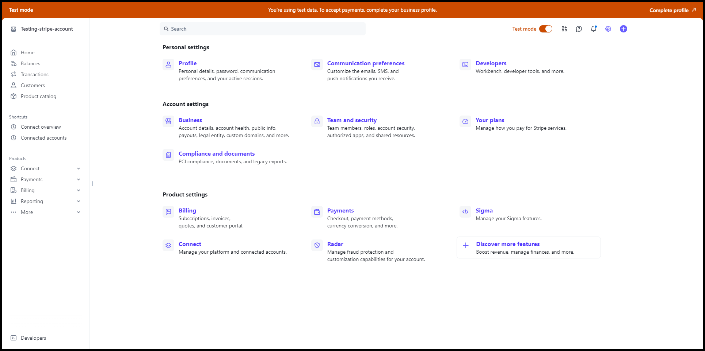
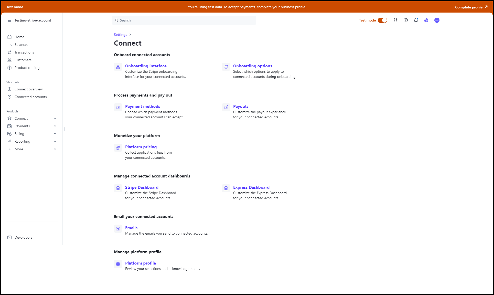
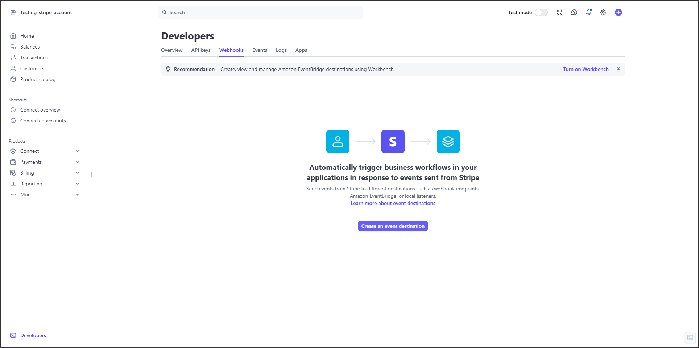
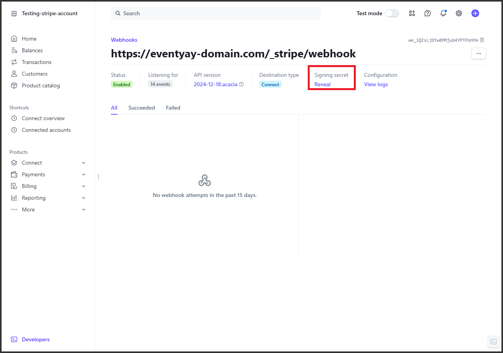
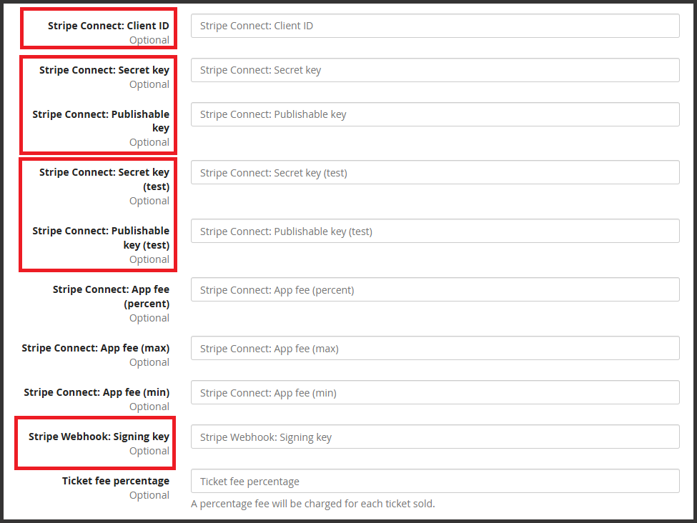

# Stripe Payment Settings Instruction

This guide will walk you through obtaining the necessary keys to integrate Stripe with your application.
To get started, you'll need an active Stripe merchant account. If you don't have one yet, you can sign up at [Stripe](http://stripe.com/).

---

## Step 1: **Configure Stripe OAuth and Retrieve Client ID**

You can refer to the [Stripe documentation](https://docs.stripe.com/connect/oauth-standard-accounts#integrating-oauth)  or follow the steps below:

1. Go to [Stripe Dashboard](https://dashboard.stripe.com/).
2. Select **Settings** in the upper-right corner of the Stripe dashboard.
3. Select the **Connect** section in **Product settings**.

    

4. In **Onboard connected accounts** section, click [Onboarding options](https://dashboard.stripe.com/settings/connect/onboarding-options/countries).

    

5. In the **OAuth** tab:

    

    - Enable OAuth (if disabled).
    - Add the URI for the Stripe OAuth flow (e.g, `https://<your-domain>/_stripe/oauth_return/`).

        

    - Copy Client ID (Test client ID if you are in test mode).

        

---

## Step 2: **Retrieve Secret Key and Publishable Key**

You can also refer to the [Stripe documentation](https://docs.stripe.com/keys) or follow the steps below:

1. Go to [Stripe Dashboard](https://dashboard.stripe.com/).
2. Log in with your credentials.
3. In the Dashboard, navigate to:
    - Click **Developers** in the left menu → Click **API keys**.
4. You will see two keys:
    - **Publishable Key**: Starts with `pk_`.
    - **Secret Key**: Starts with `sk_`.

    

5. Click **Reveal test key** or **Reveal live key** to see the **Secret Key** (depending on your mode):
    - **Test Mode**: For development and testing purposes.
    - **Live Mode**: For production use.

6. Copy both keys and store them securely.

---

## Step 3: **Retrieve Webhook Signing Key**

You can also refer to the [Stripe documentation](https://docs.stripe.com/webhooks) or follow the steps below:

1. In the Dashboard, go to:
    - Click Developers in the left menu → Click [Webhooks](https://dashboard.stripe.com/webhooks).
2. Click **Create an event destination**.

    

3. Choose the event types:
    - **Endpoint URL**: Enter the URL in your application that will handle the webhook (e.g., `https://yourdomain.com/_stripe/webhook`).
    - **Description:** Add optional description of the destination.
    - **Listen to**: Select **Events on Connected accounts**.
    - **Select events to listen to**: Choose the following events:
        - `charge.succeeded`
        - `charge.failed`
        - `charge.refunded`
        - `charge.updated`
        - `charge.dispute.created`
        - `charge.dispute.updated`
        - `charge.dispute.closed`
        - `source.chargeable`
        - `source.failed`
        - `source.canceled`
        - `payment_intent.succeeded`
        - `payment_intent.payment_failed`
        - `payment_intent.canceled`
        - `payment_intent.processing`
    - Click **Add endpoint**.

    

4. Retrieve the signing secret:

    

    - Click **Reveal** under **Signing secret**.

    - Copy the **Signing Secret** (starts with `whsec_`).

---

## **Step 4: Configure Stripe Keys to Eventyay Global Settings**

1. Log in to eventyay as an admin user.
2. Access to eventyay admin dashboard.
3. In the left menu, click to **Global settings**.

    

4. Scroll to bottom of the page and fill in the Stripe configuration fields:

    

- **Stripe Connect: Client ID**: `[Client ID from Step 1]`
- **Stripe Connect: Secret key**: `[Secret key from Step 2 (live mode)]`
- **Stripe Connect: Publishable key**: `[Publishable key from Step 2 (live mode)]`
- **Stripe Connect: Secret key (test)**: `[Secret key from Step 2 (test mode)]`
- **Stripe Connect: Publishable key (test)**: `[Publishable key from Step 2 (test mode)]`
- **Stripe Webhook: Signing secret**: `[Webhook signing secret from Step 3]`
- Click **Save**.

---

### **Notes:**

1. Ensure the Stripe payment method is enabled for Stripe settings to appear in the Eventyay admin dashboard.
2. Certain Stripe payment methods must be enabled on [organizer’s Stripe account](https://dashboard.stripe.com/settings/payments) before configuring them in Eventyay.
3. If your Stripe dashboard appears different, you might have Workbench enabled under [Developer Settings](https://dashboard.stripe.com/settings/developers). Refer to the [Stripe documentation](https://docs.stripe.com/webhooks) for updated instructions to retrieve the webhook signing key.
